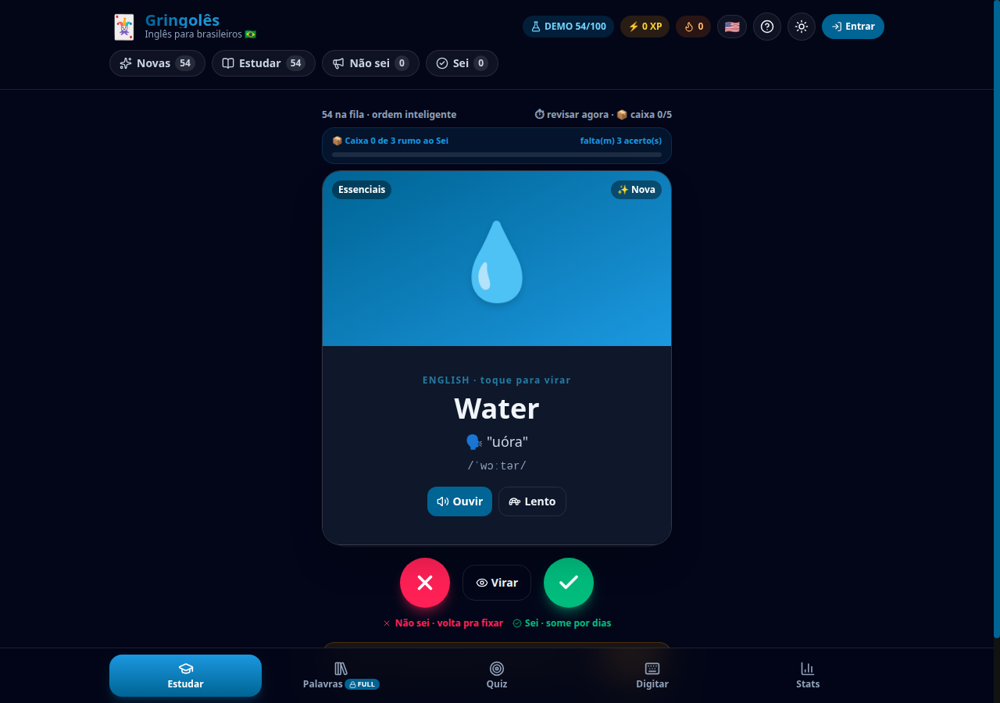

<div align="center">

# 🃏 Gringolês

### Aprenda inglês com flashcards estilo Tinder — com imagem, voz e pronúncia aportuguesada

[](https://react.dev)
[](https://www.typescriptlang.org/)
[](https://tailwindcss.com/)
[](https://vite.dev)
[](LICENSE)

<br />



<br />

**[▶ Como rodar](#-getting-started)** · **[✨ Funcionalidades](#-features)** · **[🛠️ Tecnologias](#️-tech-stack)**

</div>

---

## ✨ Features

| Feature | Description |
|---------|-------------|
| 🃏 **Swipe estilo Tinder** | Arraste para a direita = `Sei` ✅, para a esquerda = `Não sei` ❌ (ou use `←` / `→` / botões, com anti-duplo-toque) |
| 📦 **Progresso da caixa** | Selo `Caixa X de 3 rumo ao Sei` + barrinha no card — 3 acertos seguidos levam a palavra a `Sei` |
| 📅 **Palavras automáticas** | Todo dia o app injeta N palavras novas do banco curado (~220, offline), sem repetir; quantidade configurável + botão "Adiantar lote" |
| 🚫 **Anti-duplicadas** | Alerta ao digitar palavra repetida, com opção de ver o card ou salvar mesmo assim; imports relatam ignoradas |
| 📥 **Import CSV/Anki** | Botão `CSV` aceita `.csv/.tsv/.txt` com colunas `EN;PT;fonética;IPA;exEN;exPT;categoria` (tab = formato Anki) |
| 🔍 **Ajuda de preenchimento** | Botão no modal busca IPA + exemplo em inglês na API gratuita dictionaryapi.dev (só preenche campos vazios) |
| 🖼️ **Foto otimizada** | Upload comprimido (máx. 800px, JPEG) + medidor de uso do armazenamento local em Stats |
| 🔝 **3 pilhas no topo** | `✨ Novas` (sugeridas + manuais) · `📚 Não sei` (para fixar) · `✅ Sei` (dominadas) — com contadores ao vivo |
| 🔄 **Rever para fixar** | Qualquer palavra, mesmo `Sei`, pode voltar para `Não sei` com 1 clique (botão `Rever` no card) |
| 🗣️ **Voz + pronúncia BR** | Cada card tem áudio TTS en-US (normal + 🐢 lento), pronúncia aportuguesada (`Water → "uóra"`) e IPA (`/ˈwɔːtər/`) |
| 🖼️ **Imagem flexível** | Emoji + gradiente por padrão, com **upload de foto própria** por card (salva local, sem internet) |
| 🌓 **Claro / Escuro** | Toggle no topo com persistência + detecção do sistema |
| 🧠 **Repetição espaçada** | Algoritmo Leitner de 6 caixas: `0, 1, 3, 7, 15, 30 dias` — errou, revisa agora; acertou, some por dias |
| 🎯 **Modo Quiz** | Múltipla escolha com 10 perguntas embaralhadas por rodada |
| ⌨️ **Modo Digitação** | Ouça em inglês e digite a palavra (com dica de pronúncia) |
| ⚡ **Gamificação** | XP (+10 acerto / +4 tentativa), níveis, streak de dias 🔥 e gráfico de atividade |
| 🧪 **Modo demo (sem conta)** | Selo `DEMO x/teto`: palavras no `localStorage`, trava com pedido de acesso ao atingir o teto (teto editável no admin, padrão 100) |
| ☁️ **Versão full (com conta)** | Login e-mail + senha (Supabase Auth): palavras ilimitadas, progresso por usuário na nuvem, fotos no Storage. **Sem auto-cadastro** — só o admin cadastra, pelo painel |
| 🔑 **Admin** | Aba exclusiva: configurações (fila/dia, automáticas/dia, teto demo), cadastrar usuários, listar/promover/zerar, métricas, gerenciar banco de palavras; troca de senha obrigatória no 1º acesso |
| 🔍 **Emoji com busca** | Biblioteca `emoji-mart` (~1800 emojis) em popover com busca, sem poluir o modal |
| 💾 **Backup** | Export/import JSON + CSV/TSV de planilha, sempre com relatório de duplicadas |
| 📱 **Mobile-first** | Navegação inferior por abas, cards grandes, instalável como PWA manual |

---

## 🚀 Getting Started

### Prerequisites

- **Node.js** 18+ and **npm** 9+
- Navegador moderno (Chrome / Edge recomendado — melhor qualidade de voz TTS)

### Installation

```bash
# Entrar na pasta do projeto
cd /home/rafael/_PROJETOS/anki

# Install dependencies
npm install

# Configurar o backend (versão full) — copie e preencha:
cp .env.example .env

# Start the development server
npm start
# (equivalente a: npm run dev)
```

> Sem `.env`, o app roda em **modo demo** (100 palavras, tudo local). Com `.env`, libera Entrar/Criar conta.

### Banco de dados (Supabase) — só na primeira vez

```bash
# 1. Rode supabase/schema.sql no SQL Editor
# 2. Rode supabase/seed_bank.sql (307 palavras, idempotente — inclui phrasal verbs)
# 3. Rode supabase/migration_002_gamification.sql (XP/streaks + role admin)
# 4. Crie o admin em Authentication → Users (admin@admin.com) — a role e a
#    troca de senha obrigatória já vêm na migration_002
```

Navigate to **http://localhost:5175** — o app recarrega automaticamente a cada alteração.

> 🟢 **Status agora:** o servidor de desenvolvimento já está rodando em `http://localhost:5175` (verificado com HTTP 200).

### Como executar futuramente (guia rápido)

```bash
cd /home/rafael/_PROJETOS/anki
npm install   # só precisa na primeira vez ou após mudar dependências
npm start     # abre em http://localhost:5175
```

| Comando | Para que serve |
|---------|----------------|
| `npm start` / `npm run dev` | Roda o app para testar/estudar (modo desenvolvimento) |
| `npm run build` | Gera a versão final otimizada em `dist/` |
| `npm run preview` | Serve a versão final localmente para conferir antes de publicar |
| `npm run lint` | Checa problemas de código |

Para **parar** o servidor: `Ctrl + C` no terminal onde ele está rodando.

### Adicionando palavras

1. Aba **Palavras** → **＋ Nova palavra**
2. Preencha `EN*`, `PT*` e `Como se fala*` (ex: `Water`, `Água`, `uóra`)
3. Opcional: foto, exemplo em frase, categoria, cor e emoji
4. Salve — ela entra na pilha **✨ Novas** e aparece na fila de estudo

### Atalhos de teclado (aba Estudar)

| Tecla | Ação |
|-------|------|
| `←` | Não sei ❌ |
| `→` | Sei ✅ |
| `Espaço` | Virar o card |

---

## 🧠 Como funciona a fixação (SRS)

Cada acerto sobe 1 caixa Leitner; cada erro zera e o card **volta imediatamente** para a fila:

| Caixa | 0 | 1 | 2 | 3 | 4 | 5 |
|-------|---|---|---|---|---|---|
| Próxima revisão | agora | 1 dia | 3 dias | 7 dias | 15 dias | 30 dias |
| Pilha | 📚 Não sei | 📚 Não sei | 📚 Não sei | ✅ Sei | ✅ Sei | ✅ Sei |

- Fila de estudo = **vencidas primeiro** + até **N palavras novas/dia** na fila (configurável em Stats, padrão 20).
- Lote **automático diário** = N palavras do banco curado injetadas ao abrir o app (configurável em Stats, padrão 5, com liga/desliga). Dedupe por `bankId` + EN normalizado: nunca repete.
- Botão **Rever** no card força `Sei → Não sei` a qualquer momento.

---

## 🛠️ Tech Stack

- **Framework:** React 19 + TypeScript + Vite 8
- **Styling:** Tailwind CSS 4 (dark mode por classe) + gradientes + glassmorphism
- **Animações:** Framer Motion (drag/swipe do deck estilo Tinder)
- **Ícones:** lucide-react
- **Estado:** Zustand + persist (localStorage, chave `anki-flow-v1`)
- **Voz:** Web Speech API (`speechSynthesis`, `en-US` + `pt-BR`, sem custo/chave)
- **Backend:** Supabase (Postgres + Auth e-mail/senha + Storage) via `@supabase/supabase-js`, com RLS por usuário
- **Emoji:** `emoji-mart` + `@emoji-mart/data` (Picker vanilla em popover, ~1800 emojis com busca)
- **Seed:** 50 palavras curadas em `src/data/seed.ts` (essenciais, casa, comida, viagem, verbos, rotina, pessoas, tech, adjetivos)
- **Banco diário:** ~260 palavras em `src/data/bank1.ts` + `bank2.ts` (+12 categorias, ex: natureza, corpo, roupas) + `bank3.ts` (**46 phrasal verbs**, categoria própria), materializadas por `src/data/bank.ts`
- **Fotos:** upload comprimido com **transparência preservada** (PNG com alpha sai em PNG; foto opaca sai em JPEG leve) + exibição em capa desfocada com imagem nítida centralizada
- **Dicionário:** `src/lib/dictionary.ts` (dictionaryapi.dev, grátis, com timeout e fallback offline)
- **Imagens:** `src/lib/image.ts` (compressão canvas + medidor de cota)
- **Dedupe:** `src/lib/dedupe.ts` (normalização + separação novas/duplicadas)

---

## 📁 Project Structure

```
src/
├── App.tsx                     # Abas + navegação inferior
├── main.tsx                    # Bootstrap React
├── index.css                   # Tailwind + flip 3D + scrollbar + animações
├── types.ts                    # Card, Pile, Tab, DayStat
├── data/
│   ├── seed.ts                 # 50 palavras iniciais (EN/PT/fonética/IPA/exemplo/emoji)
│   ├── bank1.ts / bank2.ts     # ~220 palavras do lote diário (mesmo formato)
│   └── bank.ts                 # Seleção sem repetição + materialização em Card
├── lib/
│   ├── srs.ts                  # Leitner: intervalos, vencimento, rótulos
│   ├── speech.ts               # Web Speech API (en-US/pt-BR, normal/lento, exemplo bilíngue)
│   ├── dedupe.ts               # Normalização EN + novas vs. duplicadas
│   ├── image.ts                # Compressão de foto + uso do localStorage
│   └── dictionary.ts           # Lookup IPA/exemplo (dictionaryapi.dev)
├── store/
│   └── useStore.ts             # Zustand: cards, XP, streaks, stats, filtros, CRUD
├── supabase/
│   ├── schema.sql              # Tabelas + RLS + bucket + trigger de profile
│   ├── seed_bank.sql           # 261 palavras do word_bank (gerado, idempotente)
│   └── migration_002_gamification.sql  # XP/streaks em profiles + admin
└── components/
    ├── TopBar.tsx              # Logo + selo DEMO/FULL/ADMIN + XP/streak + tema + pilhas
    ├── AuthModal.tsx           # Entrar / criar conta + migração do demo
    ├── InviteModal.tsx         # Convite ao bater o teto de 100 (demo)
    ├── ChangePasswordGate.tsx  # Troca de senha obrigatória (admin 1º acesso)
    ├── AdminPanel.tsx          # Usuários, métricas, banco de palavras
    ├── EmojiPicker.tsx         # emoji-mart em popover com busca
    ├── StudyDeck.tsx           # Deck Tinder: swipe, flip, TTS, Rever
    ├── Library.tsx             # Busca, filtros, CRUD, upload foto, import/export JSON
    ├── QuizMode.tsx            # Múltipla escolha (10/rodada)
    ├── TypeMode.tsx            # Ditado: ouça e digite
    └── StatsView.tsx           # Nível/XP, streak, gráfico, config novas/dia
```

---

## 🏗️ Build

```bash
# Production build
npm run build

# The output will be in the dist/ directory
# Preview it locally:
npm run preview
```

Build verificado ✅ — `dist/index.html` + assets gerados sem erros (`tsc -b && vite build`).

---

## 🤝 Contributing

Contributions are welcome! Feel free to open an issue or submit a pull request.

1. Fork the project
2. Create your feature branch (`git checkout -b feature/amazing-feature`)
3. Commit your changes (`git commit -m 'Add some amazing feature'`)
4. Push to the branch (`git push origin feature/amazing-feature`)
5. Open a Pull Request

Ideias futuras: decks por tema, modo infantil, TTS neural (OpenAI/Google), sincronização em nuvem, PWA com service-worker completo.

---

## 📄 License

This project is open source and available under the [MIT License](LICENSE).

---

## 💖 Support the Project

If you enjoy this project and want to support its development, consider buying me a coffee!

<div align="center">

[](https://ko-fi.com/laurorafael)

<a href="https://ko-fi.com/laurorafael">
  
</a>

</div>

---

<div align="center">

Feito com ❤️ para quem quer finalmente destravar o inglês — **1% melhor a cada dia** 🇧🇷🚀

Made with ❤️ by [Lauro Rafael](https://lartecnologia.com.br) — **LAR Tecnologia**

[](https://github.com/LauroRafael)

</div>
