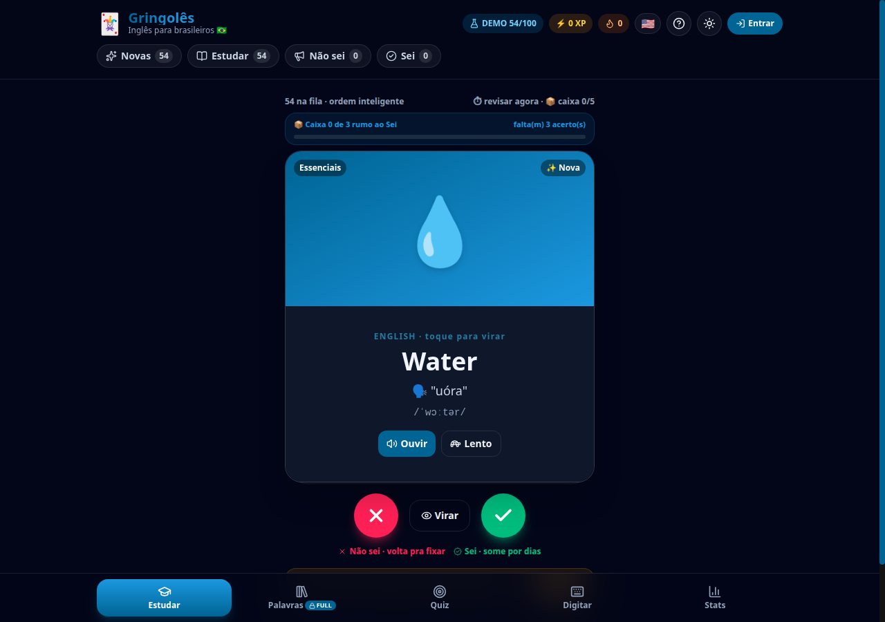

<div align="center">

<picture>
  <source media="(prefers-color-scheme: dark)" srcset="docs/logo-dark.png">
  
</picture>

### Aprenda inglês com flashcards de swipe — com imagem, voz e pronúncia aportuguesada

[](https://react.dev)
[](https://www.typescriptlang.org/)
[](https://tailwindcss.com/)
[](https://vite.dev)
[](LICENSE)

<br />



<br />

**[▶ Como rodar](#-getting-started)** · **[✨ Funcionalidades](#-features)** · **[🛠️ Tecnologias](#️-tech-stack)**

</div>

---

## ✨ Features

| Feature | Description |
|---------|-------------|
| 🃏 **Swipe nos cards** | Arraste para a direita = avança 1 caixa ✅, para a esquerda = volta 1 caixa ❌ (ou use `←` / `→` / botões, com anti-duplo-toque; em Novas o ❌ só marca como vista) |
| 📦 **Progresso da caixa** | Selo `Caixa X de 4 rumo ao Dominado` + barrinha `X/5` no card — acertou avança, errou volta; zerou a caixa, ganha celebração 🎉 |
| ⏳ **3 tempos verbais** | Todo exemplo tem **Presente, Passado e Futuro simples** (`I eat / I ate / I will eat`). Abas sempre visíveis no card de estudo (com badge quando falta tempo); na Biblioteca tem bloco de tempos + botão `Gerar com IA` (individual e **em lote, 20 por vez**). Palavras novas via IA e lote diário já nascem com os 3 tempos |
| 📅 **Palavras automáticas** | **2 entregas/dia em horários configuráveis** (ex: `08:00` e `18:00`) + N palavras por entrega; quantidade, liga/desliga e horários configuráveis no admin ou Stats + botão "Adiantar lote". Banco curado offline (~307 palavras) sem repetir; com o app aberto o lote entra **em tempo real** (polling 60s + foco/online/visível). **Bank esgotado?** Gera novas sozinho via Groq (com pronúncia, 3 tempos, emoji e categoria) — sem ninguém adicionar manualmente |
| 🚫 **Anti-duplicadas** | Alerta ao digitar palavra repetida, com opção de ver o card ou salvar mesmo assim; imports relatam ignoradas |
| 📥 **Import CSV/Anki** | Botão `CSV` aceita `.csv/.tsv/.txt` com colunas `EN;PT;fonética;IPA;exEN;exPT;categoria` (tab = formato Anki) |
| ✨ **Preencher tudo com IA** | Botão no modal completa a palavra a partir de EN ou PT via Edge Function `complete-word` (Groq + validação de IPA no dictionaryapi.dev): tradução, fonética aportuguesada, IPA, **3 tempos**, emoji e categoria. Fallback para `dictionaryapi.dev` (IPA + exemplo, só preenche campos vazios) |
| 🖼️ **Foto otimizada** | Upload comprimido (máx. 800px, JPEG; PNG com transparência preservada) + medidor de uso do armazenamento local em Stats. **Foto offline entra na fila** e sobe sozinha ao reconectar |
| 🔝 **5 caixas no topo** | `✨ Novas` · `✅ Checar` · `📚 Estudar` · `📣 Praticar` · `📦 Dominado` — com contadores ao vivo, layout mobile em grade + pills no desktop; abrir o app, voltar para Estudar ou clicar na logo sempre volta para Novas |
| 🔄 **Voltar para fixar** | Qualquer palavra pode voltar 1 caixa com o ❌; `Dominado → Praticar` com 1 clique na Biblioteca |
| 🗣️ **Voz + pronúncia BR** | Cada card tem áudio instantâneo via Web Speech API en-US (normal + 🐢 lento, voz Google no Chrome), pronúncia aportuguesada (`Water → "uóra"`) e IPA (`/ˈwɔːtər/`). Dá para ouvir palavra, exemplo EN, exemplo PT ou EN→PT em sequência |
| 🖼️ **Imagem flexível** | Emoji + gradiente por padrão (paleta azul + clássica), com **upload de foto própria** por card (local no demo, Storage na full) |
| 🌎 **PT / EN** | Interface bilíngue com toggle `🇺🇸/🇧🇷` no topo (imersão!) — tutorial, abas, cards e admin traduzidos, com persistência |
| 🌓 **Claro / Escuro** | Toggle no topo com persistência + detecção do sistema |
| 🧠 **Repetição espaçada** | SRS em 5 caixas: `Novas → Checar → Estudar → Praticar → Dominado` (`0, 1, 3, 7, 15 dias`) — acertou avança, errou volta 1; sem ordem obrigatória |
| 🎯 **Modo Quiz sem ambiguidade** | Múltipla escolha com 10 perguntas por rodada: ~40% vira **"Complete a frase"** (só com 3 distratoras de categoria diferente que não caberiam na frase — senão cai no modo clássico) + modo clássico EN→PT sem alternativas repetidas |
| ⌨️ **Modo Digitação** | Ouça em inglês e digite a palavra (com dica de pronúncia) |
| 📚 **Biblioteca paginada** | Busca + filtro por caixa, **paginação no desktop (24/pág.) e infinite scroll no mobile (12 por vez)**, botão voltar ao topo, contador `Mostrando X de Y`; demo é vitrine (ver/buscar/ouvir liberado, editar é full) |
| 👤 **Perfil** | Modal próprio: ver e-mail, trocar nome de exibição, redefinir a própria senha (8+ com letra+número) e sair |
| 📳 **Pull-to-refresh** | Puxe para baixo no mobile para sincronizar fila offline + buscar lote diário (com feedback `🎉 N novas!` / `Tudo em dia`) |
| 📴 **Offline resiliente** | Fila **outbox v2** (journal em `localStorage`, até 500 ops + 10 fotos): toda mudança grava local e sincroniza sozinha (foco/online/visível, backoff 5s→10min). Aviso `⏳ N pendentes` só se persistir + botão `Tentar agora`; workspaces demo/full isolados, IDs normalizados para UUID |
| ⚡ **Gamificação** | XP (+10 acerto / +4 tentativa), níveis, streak de dias 🔥 e gráfico de atividade |
| 🧪 **Modo demo (sem conta)** | Selo `DEMO x/teto`: palavras no `localStorage`, trava com pedido de acesso ao atingir o teto (teto editável no admin, padrão 100) |
| ☁️ **Versão full (com conta)** | Login e-mail + senha (Supabase Auth): palavras ilimitadas, progresso por usuário na nuvem, fotos no Storage. **Sem auto-cadastro** — só o admin cadastra, pelo painel |
| 🔑 **Admin completo** | Aba exclusiva: configurações (fila/dia, automáticas/entrega, **horários das 2 entregas**, teto demo), cadastrar usuários (com senha inicial forte), listar via Edge, **bloquear/desbloquear, excluir definitivo, resetar senha**, zerar progresso, promover/rebaixar, troca de senha obrigatória no 1º acesso; **banco curado editável** (CRUD com 3 tempos, ativar/desativar do lote, busca); **monitor de acessos** (aberturas totais, visitantes únicos, com conta, hoje/7d + gráfico 14 dias, tabela `visits`) |
| 🔍 **Emoji com busca** | Biblioteca `emoji-mart` (~1800 emojis) em popover com busca, sem poluir o modal |
| 💾 **Backup** | Export/import JSON + CSV/TSV de planilha, sempre com relatório de duplicadas |
| 📱 **Mobile-first** | Navegação inferior por abas, cards grandes, instalável como PWA manual, tutorial de 7 passos (PT/EN, `?notour=1` pula) |

---

## 🚀 Getting Started

### Prerequisites

- **Node.js** 18+ and **npm** 9+
- Navegador moderno (Chrome / Edge recomendado — melhor qualidade de voz TTS)

### Installation

```bash
# Entrar na pasta do projeto
cd /home/rafael/_PROJETOS/anki

# Install dependencies
npm install

# Configurar o backend (versão full) — copie e preencha:
cp .env.example .env

# Start the development server
npm start
# (equivalente a: npm run dev)
```

> Sem `.env`, o app roda em **modo demo** (100 palavras, tudo local). Com `.env`, libera Entrar/Criar conta.

### Banco de dados (Supabase) — só na primeira vez

```bash
# 1. Rode supabase/schema.sql no SQL Editor (profiles, cards, study_days, word_bank, RLS, bucket, trigger)
# 2. Rode supabase/seed_bank.sql (307 palavras, idempotente — inclui phrasal verbs)
# 3. Rode supabase/migration_002_gamification.sql (XP/streaks + role admin + bloqueio + must_change_password)
# 4. Rode supabase/migration_003_five_boxes.sql (SRS 5 caixas: Novas/Checar/Estudar/Praticar/Dominado)
# 5. Rode supabase/migration_004_verb_tenses.sql (3 tempos verbais: example_past_* + example_future_* em cards e word_bank)
# 6. Crie a tabela public.visits p/ o monitor de acessos (1 linha por abertura, com RLS de insert anônimo + select admin)
# 7. Crie o admin em Authentication → Users (admin@admin.com) — a role e a
#    troca de senha obrigatória já vêm na migration_002
```

Edge Functions (deploy via Supabase CLI — exigem `GROQ_API_KEY` para a IA funcionar):

| Função | Para que serve |
|--------|----------------|
| `complete-word` | Autopreenchimento da Biblioteca (EN/PT → palavra completa com 3 tempos) + modo `tensesFor` (gera passado/futuro de uma frase presente) |
| `generate-bank-words` | Gera palavras novas com 3 tempos quando o `word_bank` esgota (modelo Groq escolhido dinamicamente via `/models`, IPA validado no dictionaryapi.dev) |
| `admin-create-user` / `admin-manage-user` | Cadastro, listagem, bloqueio/desbloqueio, exclusão e reset de senha — só admin, sem auto-cadastro |

Sem `GROQ_API_KEY`, o app mantém o comportamento antigo (dicionário gratuito + banco curado) sem quebrar.

Navigate to **http://localhost:5175** — o app recarrega automaticamente a cada alteração.

> 🟢 **Status agora:** o servidor de desenvolvimento já está rodando em `http://localhost:5175` (verificado com HTTP 200).

### Como executar futuramente (guia rápido)

```bash
cd /home/rafael/_PROJETOS/anki
npm install   # só precisa na primeira vez ou após mudar dependências
npm start     # abre em http://localhost:5175
```

| Comando | Para que serve |
|---------|----------------|
| `npm start` / `npm run dev` | Roda o app para testar/estudar (modo desenvolvimento) |
| `npm run build` | Gera a versão final otimizada em `dist/` |
| `npm run preview` | Serve a versão final localmente para conferir antes de publicar |
| `npm run lint` | Checa problemas de código |

Para **parar** o servidor: `Ctrl + C` no terminal onde ele está rodando.

### Adicionando palavras

1. Aba **Palavras** → **＋ Nova palavra** (requer conta full — no demo a Biblioteca é vitrine)
2. Digite em EN ou PT e use **✨ Preencher tudo com IA** (completa tradução, fonética, IPA, 3 tempos, emoji e categoria) ou preencha `EN*`, `PT*` e `Como se fala*` manualmente (ex: `Water`, `Água`, `uóra`)
3. Opcional: foto, exemplos nos 3 tempos (ou `Gerar com IA` a partir do presente), categoria, cor e emoji
4. Salve — ela entra na pilha **✨ Novas** e aparece na fila de estudo
5. Cards antigos sem passado/futuro: edite e use `Gerar com IA`, ou use **Gerar tempos faltantes com IA** (20 por vez) na Biblioteca

### Tempos verbais (presente / passado / futuro)

Cada palavra tem 3 frases de exemplo. No estudo, troque pelas abas **Presente · Passado · Futuro** (sempre visíveis; badge avisa quando falta tempo). O áudio acompanha a aba ativa. Quiz e ditado usam o presente como referência.

### Idioma, perfil e offline

- Toggle `🇺🇸/🇧🇷` no topo troca todo o app (inclui tutorial de 7 passos) — bom para imersão.
- Ícone de usuário abre o **Perfil**: trocar nome, redefinir senha e sair.
- Sem internet o app continua 100%: tudo vai para a **fila offline** (`⏳ N pendentes`) e sincroniza sozinho ao reconectar (ou puxe para baixo no mobile / `Tentar agora` no aviso).

### Atalhos de teclado (aba Estudar)

| Tecla | Ação |
|-------|------|
| `←` | Voltar 1 caixa ❌ |
| `→` | Avançar 1 caixa ✅ |
| `Espaço` | Virar o card |

---

## 🧠 Como funciona a fixação (SRS)

**SRS (Spaced Repetition System, Sistema de Repetição Espaçada)** = revisar cada palavra **na hora certa de esquecer**. O cérebro fixa melhor com revisões curtas e espaçadas do que com maratonas — cada reencontro na véspera do esquecimento fortalece a memória de longo prazo.

No Gringolês o SRS é visual e simples, em **5 caixas**:

| Caixa | 0 Novas ✨ | 1 Checar ✅ | 2 Estudar 📚 | 3 Praticar 📣 | 4 Dominado 📦 |
|-------|-----------|------------|-------------|--------------|--------------|
| Próxima revisão | agora | 1 dia | 3 dias | 7 dias | 15 dias |

- **Avançar (✅, →, swipe direita)**: a palavra anda **1 caixa** (`Novas 10 → 9`, `Checar 0 → 1`). Palavras novas **nunca** pulam para outra caixa sozinhas — só com a sua ação.
- **Voltar (❌, ←, swipe esquerda)**: a palavra **volta 1 caixa** para reforçar. Exceção: em **Novas** não há anterior — o ❌ só **marca como vista** (`1/9`, `2/8`…) e a palavra continua lá, reaparecendo depois das não vistas.
- **Sem sistema de "3 acertos na mesma caixa"**: a repetição acontece **percorrendo as caixas**. Sem ordem obrigatória — estude qualquer caixa, no seu ritmo, para o cérebro absorver.
- **Caixa zerada = festa 🎉**: mensagem animada de conclusão — *"Volte mais tarde para reforçar e continuar"*.
- Lote **automático em 2 entregas/dia** = palavras do banco injetadas em **Novas** nos horários configurados (padrão `08:00` + `18:00`, N por entrega, com liga/desliga). Se o app estiver aberto, o lote entra **em tempo real** (polling 60s + foco/online/visível + pull-to-refresh) sem precisar fechar e abrir. Dedupe por `bankId` + EN normalizado: nunca repete.
- **Geração automática (usuários logados)**: quando o `word_bank` esgota para um usuário, a Edge Function `generate-bank-words` (Supabase) cria novas via **Groq** — EN, PT, fonética aportuguesada, IPA (validado no dictionaryapi.dev), **frases nos 3 tempos (presente/passado/futuro)**, emoji e categoria (inclusive categorias novas) — insere no bank e entrega o lote. Sem `GROQ_API_KEY`, o app mantém o comportamento antigo sem quebrar.
- **3 tempos verbais**: `exampleEN/PT` = presente (tempo principal — Quiz/áudio usam este); `examplePast*` e `exampleFuture*` = passado/futuro simples (opcional, `''` = não tem). Cards novos via IA já vêm com os 3; cards antigos ganham via `Gerar com IA` (unitário ou lote de 20). Migration aditiva `migration_004` + rollback em `docs/ROLLBACK-tempos-verbais.md`.
- Na Biblioteca, qualquer palavra pode ir direto para `📦 Dominado` ou voltar para `📣 Praticar`.

---

## 🛠️ Tech Stack

- **Framework:** React 19 + TypeScript + Vite 8
- **Styling:** Tailwind CSS 4 (dark mode por classe) + gradientes + glassmorphism
- **Animações:** Framer Motion (drag/swipe do deck de cards)
- **Ícones:** lucide-react
- **Estado:** Zustand + persist (localStorage, chave `anki-flow-v1`)
- **Voz:** Web Speech API pura (`speechSynthesis`, `en-US` + `pt-BR`, sem custo/chave, instantânea — voz Google no Chrome)
- **Backend:** Supabase (Postgres + Auth e-mail/senha + Storage) via `@supabase/supabase-js`, com RLS por usuário
- **Geração de palavras:** Edge Functions Deno (`complete-word` p/ autopreenchimento + tempos, `generate-bank-words` p/ lote quando o bank esgota, `admin-create-user`/`admin-manage-user` p/ gestão) + **Groq** (modelo escolhido dinamicamente via `/models`) com validação de IPA no dictionaryapi.dev
- **Offline-first:** `src/lib/outbox.ts` (journal v2 em `localStorage`: upsert/delete/meta/foto/lote, coalesce, backoff 5s→10min, teto 500 ops + 10 fotos) + `flushOutbox` na store (foco/online/visível/pull-to-refresh)
- **Monitor de acessos:** `src/lib/analytics.ts` (1 linha por abertura em `public.visits`, `visitor_id` anônimo, throttle 30min, `?nolog=1` pula) + painel admin com totais/únicos/14 dias
- **i18n:** `src/lib/i18n.ts` (PT/EN completo, `STRINGS[lang]`, toggle no TopBar com persistência)
- **Perfil:** `ProfileModal.tsx` (nome + senha própria + sair) · **Pull-to-refresh:** `PullToRefresh.tsx` (mobile, passivo, nunca bloqueia swipe) · **Erros isolados:** `TabErrorBoundary.tsx` por aba
- **Emoji:** `emoji-mart` + `@emoji-mart/data` (Picker vanilla em popover, ~1800 emojis com busca)
- **Seed:** 50 palavras curadas em `src/data/seed.ts` (essenciais, casa, comida, viagem, verbos, rotina, pessoas, tech, adjetivos)
- **Banco diário:** ~260 palavras em `src/data/bank1.ts` + `bank2.ts` (+12 categorias, ex: natureza, corpo, roupas) + `bank3.ts` (**46 phrasal verbs**, categoria própria), materializadas por `src/data/bank.ts`
- **Fotos:** upload comprimido com **transparência preservada** (PNG com alpha sai em PNG; foto opaca sai em JPEG leve) + exibição em capa desfocada com imagem nítida centralizada
- **Dicionário:** `src/lib/dictionary.ts` (dictionaryapi.dev, grátis, com timeout e fallback offline)
- **Imagens:** `src/lib/image.ts` (compressão canvas + medidor de cota)
- **Dedupe:** `src/lib/dedupe.ts` (normalização + separação novas/duplicadas)

---

## 📁 Project Structure

```
src/
├── App.tsx                     # Abas + navegação inferior + lote tempo real + avisos offline + tutorial
├── main.tsx                    # Bootstrap React
├── index.css                   # Tailwind + flip 3D + scrollbar + animações
├── types.ts                    # Card (com 3 tempos), Pile, Tab, DayStat
├── data/
│   ├── seed.ts                 # 50 palavras iniciais (EN/PT/fonética/IPA/exemplo/emoji)
│   ├── bank1.ts / bank2.ts / bank3.ts  # ~260 palavras + 46 phrasal verbs do lote diário
│   └── bank.ts                 # Seleção sem repetição + materialização em Card
├── lib/
│   ├── srs.ts                  # SRS 5 caixas: intervalos, box↔pile, normalização legada
│   ├── speech.ts               # Web Speech API pura (en-US/pt-BR, normal/lento, exemplo bilíngue)
│   ├── dedupe.ts               # Normalização EN + novas vs. duplicadas
│   ├── image.ts                # Compressão de foto + uso do localStorage
│   ├── dictionary.ts           # Lookup IPA/exemplo (dictionaryapi.dev)
│   ├── cloud.ts                # Supabase: CRUD, lote, fotos, complete-word/tempos, settings
│   ├── outbox.ts               # Journal offline v2: ops, coalesce, backoff, tetos
│   ├── analytics.ts            # Monitor de acessos (visits, visitor_id anônimo)
│   ├── i18n.ts                 # PT/EN (STRINGS, Lang)
│   └── password.ts             # Regra de senha forte (8+ com letra+número)
├── store/
│   └── useStore.ts             # Zustand: cards, XP, streaks, stats, filtros, CRUD, lote 2x/dia, outbox, auth, admin
├── supabase/
│   ├── schema.sql              # Tabelas + RLS + bucket + trigger de profile
│   ├── seed_bank.sql           # 307 palavras do word_bank (gerado, idempotente)
│   ├── migration_002_gamification.sql  # XP/streaks em profiles + admin + bloqueio + troca de senha
│   ├── migration_003_five_boxes.sql    # SRS 5 caixas (box 0..4, pile new/check/study/practice/mastered)
│   ├── migration_004_verb_tenses.sql  # 3 tempos verbais em cards + word_bank (aditiva, reversível)
│   └── functions/              # complete-word (autopreencher + tempos) · generate-bank-words (lote via Groq) · admin-create/manage-user
└── components/
    ├── TopBar.tsx              # Logo + selo DEMO/FULL/ADMIN + XP/streak + tema + idioma + 5 caixas
    ├── AuthModal.tsx           # Entrar + migração do demo (sem auto-cadastro)
    ├── InviteModal.tsx         # Convite ao bater o teto do demo
    ├── ProfileModal.tsx        # Perfil: nome + senha própria + sair
    ├── ChangePasswordGate.tsx  # Troca de senha obrigatória (admin 1º acesso)
    ├── AdminPanel.tsx          # Usuários (bloquear/excluir/reset), métricas, banco curado, monitor de acessos
    ├── EmojiPicker.tsx         # emoji-mart em popover com busca
    ├── StudyDeck.tsx           # Deck de swipe: flip, voz, 3 tempos, avançar/voltar, celebração
    ├── Library.tsx             # Busca, filtros, paginação/infinite scroll, CRUD, IA, tempos, foto, import/export
    ├── QuizMode.tsx            # Múltipla escolha + complete a frase sem ambiguidade (10/rodada)
    ├── TypeMode.tsx            # Ditado: ouça e digite
    ├── PullToRefresh.tsx       # Puxe-para-atualizar no mobile (sync + lote)
    ├── TabErrorBoundary.tsx    # Erro isolado por aba
    └── StatsView.tsx           # Nível/XP, streak, gráfico, config lote 2x/dia + horários
```

---

## 📱 Instalar como app (PWA)

O Gringolês é um **PWA instalável**: funciona em tela cheia, abre offline e avisa quando há versão nova.

- **Android (Chrome):** abra https://gringoles.com.br → menu ⋮ → **Instalar app**.
- **iPhone (Safari):** Compartilhar → **Adicionar à Tela de Início** (o app mostra esse guia sozinho).
- **Offline:** o modo demo e a tela do app funcionam sem internet; logado, o banner 📴 avisa e a **fila outbox v2 sincroniza sozinha** ao reconectar (foco/online/visível + pull-to-refresh, com backoff e botão `Tentar agora`) sem duplicar — fotos pendentes sobem junto.
- **Atualizações:** banner *"Nova versão disponível → Atualizar"* — nunca recarrega no meio do estudo.

Detalhes técnicos: `vite-plugin-pwa` (Workbox, `registerType: prompt`), precache do app shell, `NetworkFirst` p/ Supabase, `StaleWhileRevalidate` p/ dicionário, manifest em `public/manifest.webmanifest`, ícones em `public/icons/`, deploy via `netlify.toml`.

## 🏗️ Build

```bash
# Production build (gera dist/ + sw.js + precache)
npm run build

# The output will be in the dist/ directory
# Preview it locally:
npm run preview
```

Build verificado ✅ — `dist/index.html` + assets gerados sem erros (`tsc -b && vite build`).

---

## 🤝 Contributing

Contributions are welcome! Feel free to open an issue or submit a pull request.

1. Fork the project
2. Create your feature branch (`git checkout -b feature/amazing-feature`)
3. Commit your changes (`git commit -m 'Add some amazing feature'`)
4. Push to the branch (`git push origin feature/amazing-feature`)
5. Open a Pull Request

Ideias futuras: decks por tema, modo infantil, sincronização em nuvem, PWA com service-worker completo.

---

## 📄 License

This project is open source and available under the [MIT License](LICENSE).

---

## 💖 Support the Project

If you enjoy this project and want to support its development, consider buying me a coffee!

<div align="center">

[](https://ko-fi.com/laurorafael)

<a href="https://ko-fi.com/laurorafael">
  
</a>

</div>

---

<div align="center">

Feito com ❤️ para quem quer finalmente destravar o inglês — **1% melhor a cada dia** 🇧🇷🚀

Made with ❤️ by [Lauro Rafael](https://lartecnologia.com.br) — **LAR Tecnologia**

[](https://github.com/LauroRafael)

</div>
